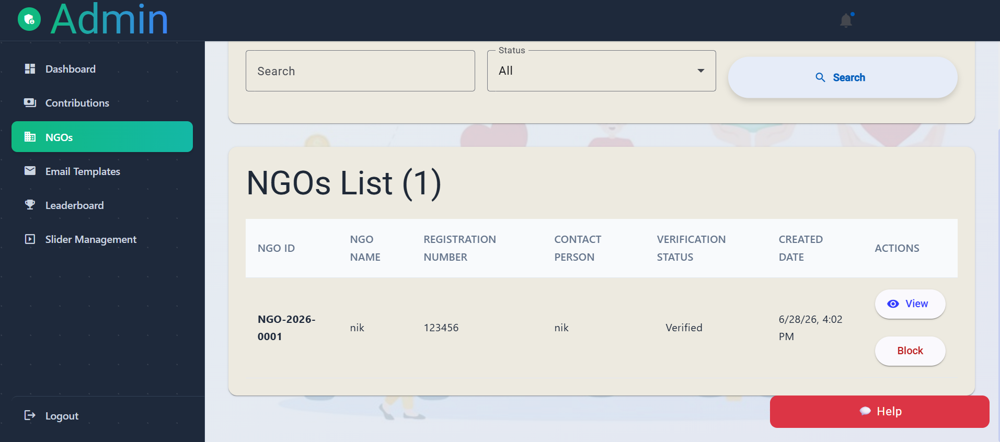
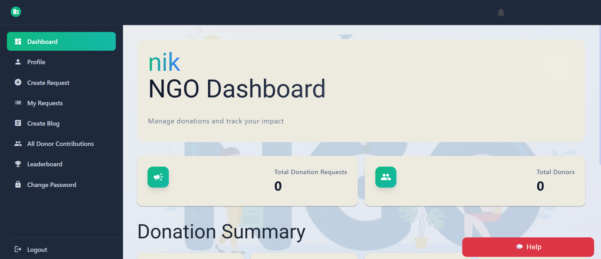
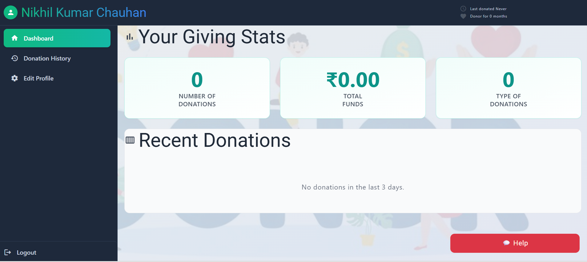

<div align="center">

<!--
  🖼️ PROJECT BANNER
  Upload banner.png to the repository root and uncomment the image below.

  
-->

# 🤝 Donation & Charity Portal

A full-stack platform connecting **Donors** and **NGOs** to make giving simple, transparent, and impactful.

[](https://angular.io/)
[](https://nodejs.org/)
[](https://expressjs.com/)
[](https://www.mysql.com/)
[](#license)

[Live Demo](#) · [Report a Bug](#) · [Request a Feature](#)

</div>

---

## 📖 About The Project

The **Donation & Charity Portal** is a web application that bridges the gap between people who want to donate (food, clothes, books, money, etc.) and verified NGOs that distribute these donations to those in need. It provides role-based dashboards for **Donors**, **NGOs**, and **Admins**, real-time notifications, pickup tracking, and a public leaderboard to encourage community participation.

### ✨ Key Features

- 🔐 **Secure Authentication** — Email/OTP based signup & login for Donors and NGOs, separate secured Admin login
- 🎁 **Donation Management** — Donors can create donation requests; NGOs can accept, schedule pickups, and track status
- 📊 **Role-Based Dashboards** — Dedicated dashboards for Donors, NGOs, and Admins with real-time stats
- 🔔 **Real-Time Notifications** — Live updates using Socket.IO whenever a donation status changes
- 🏆 **Leaderboard** — Recognizes top-contributing donors and NGOs
- 📝 **NGO Blog** — NGOs can publish updates and stories about their work
- 🖼️ **Homepage Sliders & Content Management** — Admin-manageable homepage content
- 📍 **Pickup Tracking** — Track donation pickups from request to completion
- 📱 **Fully Responsive** — Built with Angular Material for a clean experience on any device

---

## 📸 Dashboard Screenshots

### Admin Dashboard

<p align="center">
  
</p>

### NGO Dashboard

<p align="center">
  
</p>

### User Dashboard

<p align="center">
  
</p>

---

## 🛠️ Tech Stack

| Layer | Technology |
|---|---|
| **Frontend** | Angular 18, Angular Material, RxJS, Socket.IO Client |
| **Backend** | Node.js, Express, TypeScript |
| **Database** | MySQL |
| **Real-time** | Socket.IO |
| **Auth** | JWT, bcrypt, Email OTP verification |
| **Email** | Brevo (Transactional Email API) |
| **Deployment** | Netlify (Frontend) · Render (Backend) · Hostinger (MySQL) |

---

## 📁 Project Structure

```text
Donation-charity/
├── frontend/                  # Angular application
│   └── src/app/
│       ├── auth/              # Donor/NGO login, signup, OTP verification
│       ├── admin/             # Admin login, register, dashboard
│       ├── donor/             # Donor dashboard, contributions, donation list
│       ├── ngo/               # NGO dashboard, requests, blog management
│       ├── pages/             # Static pages (about, blog, 404)
│       ├── shared/            # Shared header, notification bell, etc.
│       └── services/          # API, auth, and socket services
│
└── backend/                   # Express + TypeScript API
    └── src/
        ├── controllers/       # Route handlers
        ├── routes/            # Express route definitions
        ├── models/            # Data models
        ├── services/          # Business logic
        ├── middleware/        # Auth, role, error handling
        ├── utils/             # JWT, email, OTP, logging utilities
        ├── socket/            # Socket.IO server setup
        └── config/            # Environment and MySQL configuration


🚀 Getting Started

Prerequisites


Node.js v18 or higher
npm
A MySQL database (local or hosted, e.g. Hostinger, PlanetScale, etc.)
A Brevo account for sending transactional (OTP) emails


1. Clone the repository

bashgit clone https://github.com/<your-username>/Donation-charity.git
cd Donation-charity

2. Backend Setup

bashcd backend
npm install

Create a .env file inside backend/ with the following variables:

env# Server
PORT=4000
NODE_ENV=development
FRONTEND_URL=http://localhost:4200

# Auth
JWT_SECRET=your_jwt_secret
ADMIN_SECURITY_CODE=your_admin_security_code

# MySQL
MYSQL_HOST=your_mysql_host
MYSQL_PORT=3306
MYSQL_USER=your_mysql_user
MYSQL_PASSWORD=your_mysql_password
MYSQL_DATABASE=your_mysql_database

# Email (Brevo API)
BREVO_API_KEY=your_brevo_api_key
SMTP_FROM=Your App Name <your_verified_sender@email.com>

Run the backend:

bashnpm run dev       # development (with hot reload)
npm run build      # compile TypeScript
npm start          # run compiled build

3. Frontend Setup

bashcd frontend
npm install
npm start

The app will be available at http://localhost:4200, and the API at http://localhost:4000.


🌐 Deployment

This project is designed to be deployed across three free/low-cost services:

ServiceUsed ForNetlifyHosting the Angular frontendRenderHosting the Node.js/Express backendHostingerHosting the MySQL database


⚠️ Note: Render's free tier blocks outbound SMTP ports (25, 465, 587). This project uses Brevo's HTTP API instead of traditional SMTP to send OTP emails, so it works reliably on free hosting tiers.


Make sure FRONTEND_URL on the backend exactly matches your deployed frontend URL (no trailing slash) to avoid CORS issues.


🔑 Environment Variables Reference

VariableDescriptionPORTPort the backend server runs onNODE_ENVdevelopment or productionFRONTEND_URLDeployed frontend URL, used for CORSJWT_SECRETSecret key used to sign JWT tokensADMIN_SECURITY_CODESecurity code required for admin registrationMYSQL_HOST / MYSQL_PORT / MYSQL_USER / MYSQL_PASSWORD / MYSQL_DATABASEMySQL connection detailsBREVO_API_KEYAPI key from your Brevo account, used to send OTP emailsSMTP_FROMSender name & email shown on outgoing emails (must be a verified sender in Brevo)


🤝 Contributing

Contributions are welcome! To contribute:


Fork the project
Create your feature branch (git checkout -b feature/AmazingFeature)
Commit your changes (git commit -m 'Add some AmazingFeature')
Push to the branch (git push origin feature/AmazingFeature)
Open a Pull Request


📄 License

Distributed under the MIT License. See LICENSE for more information.


👤 Author

Nikhil Chauhan


GitHub: @nikhilchauhan018


<div align="center">
Made with ❤️ to make giving easier.

</div>
